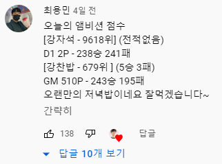
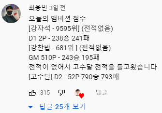
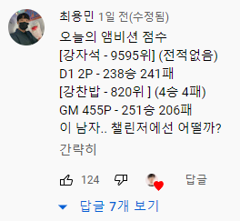
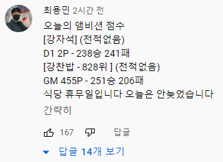
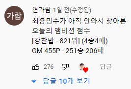
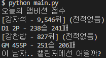

# Today-s-Ambition-score



  

  
누구나 최용민수가 될 수 있다!  
최용민수의 시간을 아끼기 위해 만들었습니다.  
Special Thanks to 최용민수

## Environment
### OS  
Window 10
### Python
3.9.1
### Package
* os  
DEVELOPMENT_API_KEY를 환경변수로 숨기기 위해 사용
* requests  
Riot API 사용하기 위해 사용
* time  
오늘 날짜 구하기 위해 사용
* bs4  
fow.kr에서 오늘 승패수, 순위 구하기 위해 사용

기타 사용된 패키지 전체는 requirement.txt를 통해 확인하실 수 있습니다.

## Running the server locally
1. Clone this repository.
```terminal
git clone https://github.com/c2lv/Today-s-Ambition-score.git
```
2. Change directory and activate virtualenv.
```terminal
cd Today-s-Ambition-score.git
pip install virtualenv
virtualenv "Enter Your Virtual Environment Name"
source "Enter Your Virtual Environment Name"/Scripts/activate
```
3. Add DEVELOPMENT_API_KEY in `RIOTGAMES_API_KEY` (Config Var).
```terminal
export RIOTGAMES_API_KEY="Enter Your DEVELOPMENT_API_KEY"
```
4. Install the requirements.
```terminal
pip install -r requirements.txt
```
5. Run `main.py` file.
```terminal
python main.py
```

## Reference

[Riot Developer Portal](https://developer.riotgames.com/)
